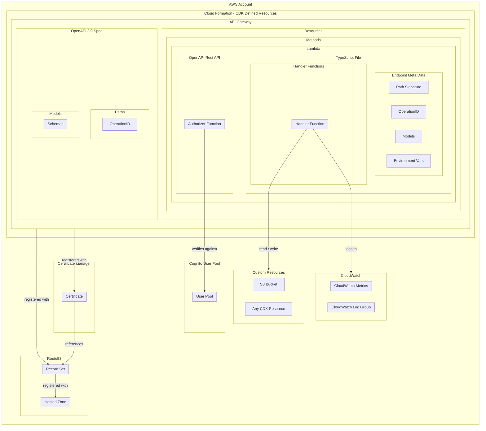

# OpenAPI Rest API

A AWS-CDK library to create a self-documenting AWS API Gateway Rest API using OpenAPI 3.0.0 specification, and AWS Lambda endpoints.

## Why

>Make it as simple as possible, but not simpler.

This library was created to make it easier to create a self-documenting API using AWS Lambda and API Gateway. The library uses the OpenAPI 3.0.0 specification to create the API Gateway Rest API, and uses AWS Lambda to create the endpoints. The library also creates the DNS records, SSL certificate, and Cognito User Pool to secure the API.

The architecture is designed to be as cheap as possible to run, whilst still being able to scale massively to meet demand. The code is designed to be as simple as possible to write, whilst still being able to handle complex business logic and support custom CDK resources.

## How

>Things that change together should stay together.

The library uses the AWS CDK to create the AWS resources. The CDK is a framework for defining cloud infrastructure in code, and is written in TypeScript. The CDK is used to create the AWS resources, and the library is used to allow the custom application logic and the OpenAPI specification to be defined in a single TypeScript file for each endpoint.

The library creates the API Gateway as a Rest API, and uses AWS Lambda to create the endpoints. The library also creates the DNS records, SSL certificate, and an authorizer lambda which verifies against Cognito User Pool to secure the API.

## What

>Easy to deploy, easy to destroy. Recreate from scratch at any time.

An API on a custom hosted zone:
- e.g. https://my-api.my-hosted-zone.com

By using this library, you will create and configure a large number of AWS resources as part of a Cloud Formation stack. This stack can be deployed and destroyed easuky, and can be recreated from scratch at will. This means that you can easily create a new environment, or recreate an existing environment, at any time - and the costs are minimal. The only substantial ongoing costs are the storage costs for S3 and the hosting costs for the API Gateway.

Lets jump into the resources that are created...

## Architecture

Here is a diagram of the architecture produced by the OpenAPI Rest API library.



### Breakdown

There's a lot going on here, so let's break it down.

- AWS Account - The AWS account where the API will be deployed.
- Cloud Formation - The AWS service that will be used to deploy the API.
- API Gateway - The AWS service that will be used to create the API.
- Lambda - The AWS service that will be used to create the endpoints.
- OpenAPI - The specification that will be used to describe the API - third party tools can use this specification to generate documentation and client libraries.
- TypeScript File - The file that will be used to define the endpoints.
- Handler Functions - The functions that will be used to handle the requests; this is where you should write your custom business logic.
- Endpoint Meta Data - The data that will be used to define the endpoints - this data lives in the TypeScript file with the handler functions, and is used to create the OpenAPI specification.
- OpenAPI Rest API - The API that will be created using the OpenAPI specification.
- Authorizer - The function that will be used to authorize requests.
- Route53 - The AWS service that will be used to create the DNS records.
- Hosted Zone - The pre-registered DNS zone that will be used to create the DNS records.
- Record Set - The DNS record that will map the API to a domain name
- Certificate Manager - The AWS service that will be used to create the SSL certificate for the registered domain name.
- Certificate - The SSL certificate that will be used to secure the API.
- Cognito User Pool - An external authentication service that will be used to authorize requests.
- Custom Resources - Additional AWS resources that are custom to the application's needs.
- CloudWatch - The AWS service that will be used to access logs and metrics.
- CloudWatch Log Group - The log group that will be used to store logs from then handler functions when run via AWS Lambda.
- CloudWatch Metrics - The metrics for each lambda to track system activations and health.

## Usage

To an existing CDK project, add the following dependency:

```sh
npm install @connected-web/openapi-rest-api
```

See the [examples](./examples) folder for a practical project example.

You will likely want pre-deployment tests in place to ensure your stack builds correctly. See the [pre-deployment/api-stack.test.ts](./test-api/src/tests/pre-deployment/api-stack.test.ts) file for an example.