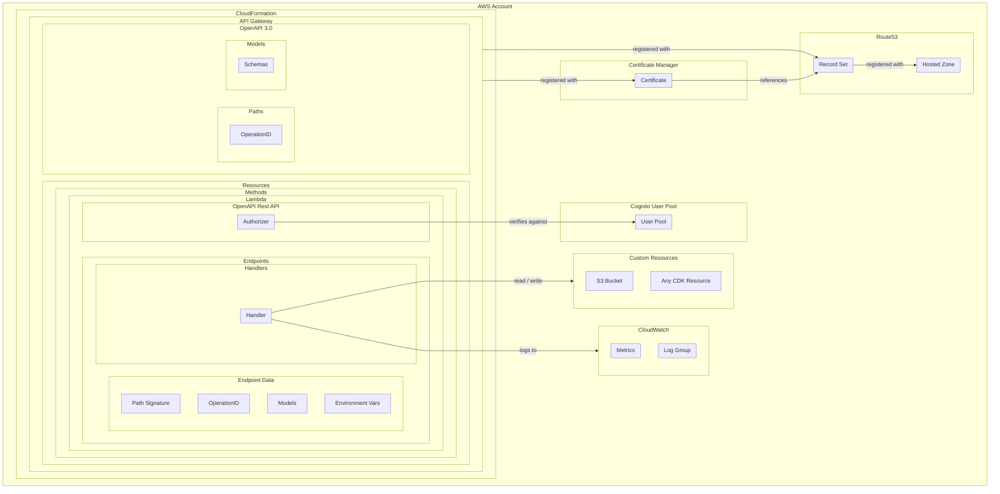

# OpenAPI Rest API

An AWS-CDK library for building very cheap and extremely scalable OpenAPI documented APIs using AWS API Gateway, and AWS Lambda.

## Project Goals

- 🤔 Simplify API creation with AWS Lambda and API Gateway using OpenAPI 3.0.0. Enhance security with DNS records, SSL certificates, and Cognito User Pool.
- 🛠️ AWS CDK deploys resources, combining custom logic and OpenAPI in TypeScript. Utilizes API Gateway, AWS Lambda, and an authorizer lambda for security.
- 📦 Achieve a custom API on a hosted domain, easily deployable and recreatable with minimal ongoing costs.

## Usage

To an existing CDK project, add the following dependency:

```sh
npm install @connected-web/openapi-rest-api
```

## Example API

The [examples](./examples) folder demonstrates the skeleton for a practical project.

There should be at least four parts to each OpenAPI REST API project:

- 🌐 API Stack  - extends `cdk.Stack` and implements `OpenAPIRestAPI<*>`
- 📦 Resources* - extends `cdk.Construct` and contains shared resources to pass between endpoints
- 📊 Models     - extends `OpenAPIBasicModels` and contains the request and response data models for each endpoint
- 🚀 Endpoints  - extends `OpenAPIEndpoint` and contains the business logic for each endpoint

### 🌐 Example API Stack

The CDK stack is used to create the API Gateway, and to create the endpoints. The CDK stack should extend `cdk.Stack` and implement `OpenAPIRestAPI<*>`. The `OpenAPIRestAPI<*>` interface requires the following parameters:

- `Description` - A description of the API
- `SubDomain` - The subdomain that will be used to host the API
- `HostedZoneDomain` - The domain that will be used to host the API
- `Verifiers` - An array of verifiers that will be used to verify requests using Cognito User Pool clients
- `AuthorizerARN` - (Optional) An ARN of a pre-existing authorizer lambda
- `AuthorizerPath` - (Optional) The path to a customer authorizer lambda function file
- `HeaderAuthorizer` - (Optional) Configuration for a header-based authorizer
- `StageName` - (Optional) The stage name that will be used to host the API (default: 'v1')
- `AdditionalCORSHeaders` - (Optional) An array of additional CORS headers that will be added to the API (default: ['Authorization', 'content-type'])

#### Example Verifiers

The authorizer supports multiple Cognito User Pool clients to allow for different environments, or different applications to use the same API. Each verifier requires the following parameters:

```json
"Verifiers": [{
  "name": "Users Dev",
  "userPoolId": "eu-west-2_VBRbzaly6",
  "tokenUse": "access",
  "clientId": "abcd1234ghij5678klmn9012",
  "oauthUrl": "https://connected-web.auth.eu-west-2.amazoncognito.com"
}]
```

#### Example HeaderAuthorizer

Header-based authorization can be used to validate requests based on custom headers. This is useful for machine-to-machine communication, or for simple API key validation. The `HeaderAuthorizer` configuration supports the following parameters:

```json
"HeaderAuthorizer": {
  "requiredHeadersWithAllowedValues": {
    "x-api-key": ["my-secret-api-key"]
  },
  "requiredHeadersRegexValues": {
    "x-request-id": ["^[a-f0-9]{8}-[a-f0-9]{4}-[a-f0-9]{4}-[a-f0-9]{4}-[a-f0-9]{12}$"] // UUID v4
  },
  "disallowedHeaders": ["x-bad-header"],
  "disallowedHeaderRegexes": ["^x-disallowed-.*$"]
}
```

Note when using `HeaderAuthorizer`, the `resultsCacheTtl` is set to `0` seconds to disable caching, ensuring each request is validated against the specified headers.

#### Other OpenAPIRestAPI Features

The `OpenAPIRestAPI<*>` interface also supports the following methods:

- `addEndpoints` - Adds an array of endpoints to the API
- `report` - Reports the API Gateway URL and the OpenAPI specification URL

Example: [./ExampleAPI.ts](./examples/src/ExampleAPI.ts)

```typescript
import * as cdk from 'aws-cdk-lib'
import { Duration } from 'aws-cdk-lib'
import { Function, Runtime } from 'aws-cdk-lib/aws-lambda'

import { Construct } from 'constructs'
import { OpenAPIRestAPI, OpenAPIFunction, OpenAPIVerifiers, OpenAPIBasicModels } from '@connected-web/openapi-rest-api'

import { ExampleResources } from './Resources'
import { StatusEndpoint } from './endpoints/Status'
import { ReceivePayloadEndpoint } from './endpoints/ReceivePayload'

export interface IdentityConfig {
  verifiers: OpenAPIVerifiers
}

export interface StackParameters { hostedZoneDomain: string, serviceDataBucketName: string, identity: IdentityConfig }

export class ExampleAPIStack extends cdk.Stack {
  constructor (scope: Construct, id: string, props: cdk.StackProps, config: StackParameters) {
    super(scope, id, props)

    // Configure custom defaults for all lambdas
    OpenAPIFunction.applyDefaultProps({
      runtime: Runtime.NODEJS_LATEST,
      timeout: Duration.seconds(10),
      memorySize: 768
    })

    // Create shared resources
    const sharedResources = new ExampleResources(scope, this)

    // Create API Gateway
    const apiGateway = new OpenAPIRestAPI<ExampleResources>(this, 'Example API', {
      Description: 'Example API - https://github.com/connected-web/openapi-rest-api',
      SubDomain: 'example-api',
      HostedZoneDomain: config.hostedZoneDomain,   // this hosted zone should already exist in the AWS account
      Verifiers: config?.identity.verifiers ?? [], // provide a list of Cognito User Pool clients to verify against
      // Optional alternative: AuthorizerLambdaArn: config?.identity.authorizerLambdaArn // supply a custom authorizer lambda via ARN
      StackName: 'v1', // Default: 'v1'
      AdditionalCORSHeaders: ['x-continuation-token'] // Defaults: ['Authorization', 'content-type']
    }, sharedResources)

    // Kick of dependency injection for shared models and model factory
    OpenAPIBasicModels.setup(this, apiGateway.restApi)

    // Add endpoints to API
    apiGateway
      .addEndpoints({
        'GET /status': new StatusEndpoint(),
        'PUT /receive-payload/{pathParam}': new ReceivePayloadEndpoint(sharedResources)
      })
      .report()
  }
}
```

### 📦 Example Resources

The resources class is used to create shared resources that can be passed between endpoints. This is useful for resources that are used by multiple endpoints, such as a data bucket, or any other custom CDK resources supported by AWS.

Example: [./Resources.ts](./examples/src/Resources.ts)

```typescript
import { Construct } from 'constructs'
import * as cdk from 'aws-cdk-lib'
import * as s3 from 'aws-cdk-lib/aws-s3'

export class ExampleResources {
  scope: Construct
  stack: cdk.Stack

  constructor (scope: Construct, stack: cdk.Stack) {
    this.scope = scope
    this.stack = stack
  }

  get serviceDataBucket (): s3.Bucket {
    const serviceBucketName = process.env.SERVICE_BUCKET_NAME ?? 'test-api-service-data-bucket'
    return new s3.Bucket(this.stack, 'ExampleServiceBucket', {
      bucketName: serviceBucketName,
      removalPolicy: cdk.RemovalPolicy.DESTROY,
      versioned: true
    })
  }
}
```

### 📊 Example Model

The models are used to define the request and response data for each endpoint. These models are also used to create the OpenAPI specification, which can then be used to validate the request and response data, as well as generate documentation and client libraries.

Example: [./models/ApiPayload.ts](./examples/src/models/ApiPayload.ts)

```typescript
import { IModel, JsonSchemaType, JsonSchemaVersion } from 'aws-cdk-lib/aws-apigateway'
import { OpenAPIBasicModels } from '@connected-web/openapi-rest-api'

export class ApiPayload extends OpenAPIBasicModels {
  static get model (): IModel {
    return OpenAPIBasicModels.modelFactory?.create('ApiPayload', {
      schema: JsonSchemaVersion.DRAFT7,
      title: 'Basic API Payload',
      type: JsonSchemaType.OBJECT,
      properties: {
        operationId: {
          type: JsonSchemaType.INTEGER,
          description: 'The HTTP status code of the response'
        },
        payload: {
          type: JsonSchemaType.OBJECT,
          description: 'The data payload of the request'
        }
      },
      required: ['operationId', 'payload']
    }) as IModel
  }
}

export interface ApiPayloadType {
  operationId: number
  payload: any
}
```

### 🚀 Example Endpoint

The API, Resources, and Models all come together in the endpoint. The endpoint is a TypeScript file that contains the business logic for the endpoint, and the metadata that describes the endpoint. The metadata is used by the CDK to create the stack that will host the endpoint, and is also used by the library to create the OpenAPI specification.

Example metadata: [./endpoints/Status/metadata.ts](./examples/src/endpoints/Status/metadata.ts)

```typescript
import { Construct } from 'constructs'
import path from 'path'
import { NodejsFunction, NodejsFunctionProps } from 'aws-cdk-lib/aws-lambda-nodejs'
import { MethodResponse } from 'aws-cdk-lib/aws-apigateway'

import { OpenAPIRouteMetadata } from '@connected-web/openapi-rest-api'
import { ExampleResources } from '../../Resources'
import { ApiResponse } from '../../models/ApiResponse'

/* This section is for route metadata used by CDK to create the stack that will host your endpoint */
export class StatusEndpoint extends OpenAPIRouteMetadata<ExampleResources> {
  grantPermissions (scope: Construct, endpoint: NodejsFunction, resources: ExampleResources): void {
    const serviceBucket = resources.serviceDataBucket
    serviceBucket.grantRead(endpoint)
  }

  get operationId (): string {
    return 'getStatus'
  }

  get restSignature (): string {
    return 'GET /status'
  }

  get routeEntryPoint (): string {
    return path.join(__dirname, 'handler.ts')
  }

  get lambdaConfig (): NodejsFunctionProps {
    return {
      environment: {
        STATUS_INFO: JSON.stringify({
          deploymentTime: process.env.USE_MOCK_TIME ?? new Date()
        })
      }
    }
  }

  get methodResponses (): MethodResponse[] {
    return [{
      statusCode: '200',
      responseParameters: {
        'method.response.header.Content-Type': true,
        'method.response.header.Access-Control-Allow-Origin': true,
        'method.response.header.Access-Control-Allow-Credentials': true
      },
      responseModels: {
        'application/json': ApiResponse.model
      }
    }]
  }
}
```

Example handler: [./endpoints/Status/handler.ts](./examples/src/endpoints/Status/handler.ts)

```typescript
import { APIGatewayProxyEvent, APIGatewayProxyResult } from 'aws-lambda'
import { httpStatusCodes, lambdaResponse } from '../../helpers/Response'

/* This handler is executed by AWS Lambda when the endpoint is invoked */
export async function handler (event: APIGatewayProxyEvent): Promise<APIGatewayProxyResult> {
  const statusInfo = process.env.STATUS_INFO ?? JSON.stringify({ message: 'No STATUS_INFO found on env' })
  return lambdaResponse(httpStatusCodes.success, statusInfo)
}
```

### 🔐 API Authorization

By design, all endpoints are protected by an Authorization lambda.

By default, the library will create an authorizer lambda that verifies against a Cognito User Pool. This requires you to pass a list of verifiers to the API Gateway stack, which you will need to create and configure separately to this project. The idea being that you can reuse the same Cognito User Pool between multiple APIs.

All verifiers are checked in order, and the first verifier to return a valid response will be used to authorize the request. If no verifiers return a valid response, the request will be rejected. This allows you to have multiple environments, and to have different verifiers for each environment. For example, you could have a production environment with a production Cognito User Pool, and a development environment with a development Cognito User Pool.

```json
{
  "Verifiers": [{
    "name": "Users Dev",
    "userPoolId": "eu-west-2_VBRbzaly6",
    "tokenUse": "access",
    "clientId": "123abc456def789ghi012jkl345",
    "oauthUrl": "https://connected-web.example.auth.us-east-1.amazoncognito.com"
  }, {
    "name": "Apps Dev",
    "userPoolId": "eu-west-2_VBRbzaly6",
    "tokenUse": "access",
    "clientId": "456def789ghi012jkl345123abc",
    "oauthUrl": "https://connected-web.example.auth.us-east-2.amazoncognito.com"
  }]
}
```

Alternatively, you can supply your own authorizer lambda by passing an ARN to the OpenAPIRestAPI constructor. This allows you to preconfigure, and reuse an existing authorizer between APIs - enabling a single sign-on experience for your users.

```json
{
    "AuthorizerARN": "arn:aws:lambda:us-east-3:123456789012:function:connected-web-shared-authorizer"
}
```

### Testing

You will likely want pre-deployment tests in place to ensure your stack builds correctly.

See the [tests/api-stack.test.ts](./examples/src/tests/api-stack.test.ts) file for an example.

## Design Considerations

### 🤔 Simplify AWS Lambda API Creation with OpenAPI standards

>Make it as simple as possible, but not simpler.

This library was created to make it easier to create a self-documenting API using AWS Lambda and API Gateway. The library uses the OpenAPI 3.0.0 specification to create the API Gateway Rest API, and uses AWS Lambda to create the endpoints. The library also creates the DNS records, SSL certificate, and Cognito User Pool to secure the API.

The architecture is designed to be as cheap as possible to run, whilst still being able to scale massively to meet demand. The code is designed to be as simple as possible to write, whilst still being able to handle complex business logic and support custom CDK resources.

### 🛠️ Unified AWS Resource Management with CDK

>Things that change together should stay together.

The library uses the AWS CDK to create the AWS resources. The CDK is a framework for defining cloud infrastructure in code, and is written in TypeScript. The CDK is used to create the AWS resources, and the library is used to allow the custom application logic and the OpenAPI specification to be defined in a single TypeScript file for each endpoint.

The library creates the API Gateway as a Rest API, and uses AWS Lambda to create the endpoints. The library also creates the DNS records, SSL certificate, and an authorizer lambda which verifies against Cognito User Pool to secure the API.

### 📦 Low-effort AWS Resource Management for On-Demand Deployment

>Easy to deploy, easy to destroy. Recreate from scratch at any time.

An API on a custom hosted zone:
- e.g. https://my-api.my-hosted-zone.com

By using this library, you will create and configure a large number of AWS resources as part of a Cloud Formation stack. This stack can be deployed and destroyed easily, and can be recreated from scratch at will. This means that you can easily create a new environment, or recreate an existing environment, at any time - and the costs are minimal. The only substantial ongoing costs are the storage costs for S3 and the hosting costs for the API Gateway.

## Architecture

Here is a diagram of the architecture produced by the OpenAPI Rest API library:



### Key architectural features

- 📋 AWS Account: The deployment location for the API.
- 🏗️ Cloud Formation: Service for API deployment.
- 🌐 API Gateway: Tool for API creation.
- 🚀 Lambda: Service for endpoint creation and business logic.
- 📄 OpenAPI: Specification for API description and documentation generation.

### Component Key

| Component              | Description                                                       |
|------------------------|-------------------------------------------------------------------|
| AWS Account            | The AWS account where the API will be deployed.                   |
| Cloud Formation        | The AWS service that will be used to deploy the API.              |
| API Gateway            | The AWS service that will be used to create the API.              |
| Lambda                 | The AWS service that will be used to create the endpoints.        |
| OpenAPI                | The specification that will be used to describe the API.          |
| TypeScript File        | The file that will be used to define the endpoints.               |
| Handler Functions      | The functions that will be used to handle the requests; this is where you should write your custom business logic. |
| Endpoint Meta Data     | The data that will be used to define the endpoints; this data lives in the TypeScript file with the handler functions and is used to create the OpenAPI specification. |
| OpenAPI Rest API       | The library used to create the necessary resources for the API.   |
| Authorizer             | The function that will be used to authorize requests.             |
| Route53                | The AWS service that will be used to create the DNS records.      |
| Hosted Zone            | The pre-registered DNS zone that will be used to create the DNS records. |
| Record Set             | The DNS record that will map the API to a domain name.            |
| Certificate Manager    | The AWS service that will be used to create the SSL certificate for the registered domain name. |
| Certificate            | The SSL certificate that will be used to secure the API.          |
| Cognito User Pool      | An external authentication service that will be used to authorize requests. |
| Custom Resources       | Additional AWS resources that are custom to the application's needs. |
| CloudWatch             | The AWS service that will be used to access logs and metrics.     |
| CloudWatch Log Group   | The log group that will be used to store logs from the handler functions when run via AWS Lambda. |
| CloudWatch Metrics     | The metrics for each lambda to track system activations and health. |

## Environment Variables for CI

### CREATE_CNAME_RECORD

If this environment variable is set to `true`, the CDK stack will create a CNAME record in the hosted zone that points to the API Gateway. This is useful if you want to host the API on a custom domain. It is sometimes useful to toggle this  when creating and destroying new resources to avoid CloudFormation conflicts.

### OPENAPI_REST_API_REPORT_SUMMARY

If this environment variable is set to `true`, the CDK stack will report the API Gateway URL and the OpenAPI specification URL. This is useful if you want to quickly access the API Gateway URL and the OpenAPI specification URL after deployment. It also summarises a table of endpoints, which is useful documentation for the API that you can copy and paste out of the `GITHUB_STEP_SUMMARY`.

For example:

```
      - name: Deploy the CDK Stack
        run: npm run deploy -- --require-approval never
        env:
          CREATE_CNAME_RECORD: true
          OPENAPI_REST_API_REPORT_SUMMARY: true
```

## Contributions and Questions

Please raise an issue on GitHub if you have any questions, or if you would like to contribute to the project.

## License

Released under ISC License

Copyright 2025 Connected Web (since 2023)

See [LICENSE.md](./LICENSE.md) for more information.